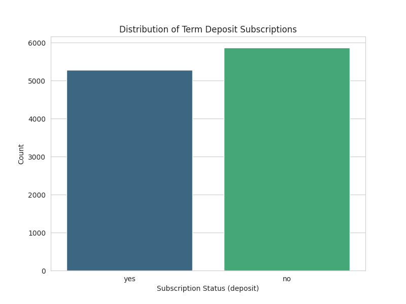
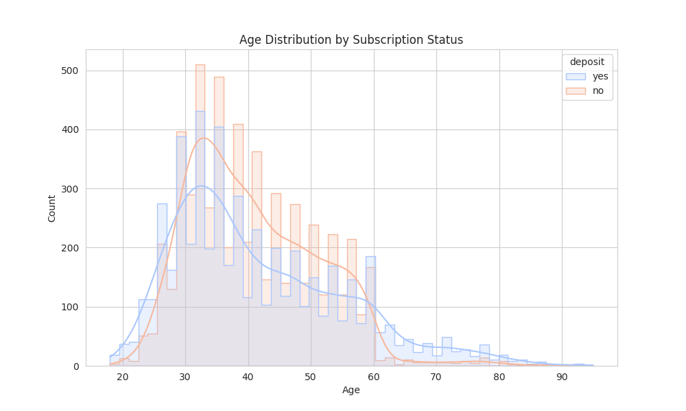
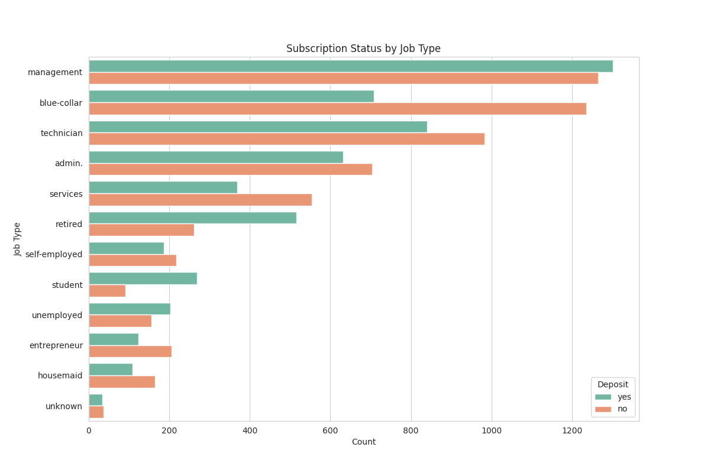
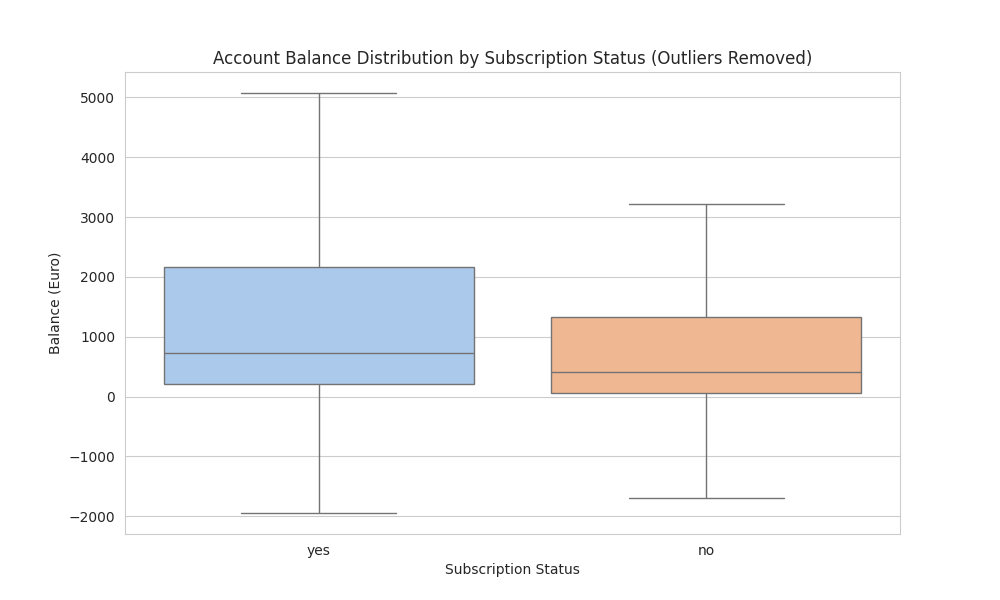
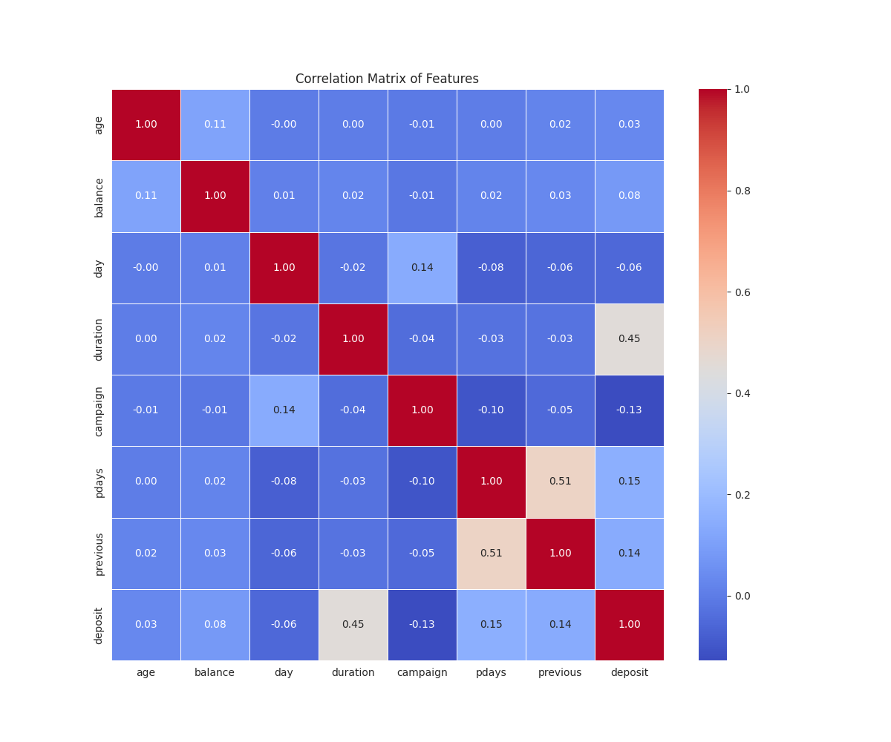

# Bank Marketing Campaign Analysis Report

**Name:** N.T.P.G.R.Pasan
**Registration Number:** 2021/IS/072
**Index Number:** 21020728
**Dataset URL:** https://www.kaggle.com/janiobachmann/bank-marketing-dataset
**Github Repository URL:** https://github.com/Ravindu62/bis-4116-assignment.git

---

## 1. Executive Summary
This report presents an analysis of direct marketing campaigns (phone calls) of a Portuguese banking institution. The classification goal is to predict if the client will subscribe to a term deposit (variable `deposit`).

**Key Findings:**
- **Call Duration is Critical:** There is a strong positive correlation between call duration and subscription success. Longer engagement typically leads to a positive outcome.
- **Account Balance Matters:** Clients who subscribed had, on average, a 40% higher account balance (€1,804) compared to those who did not (€1,280).
- **Campaign Fatigue:** Repeated contacts during the same campaign (`campaign` variable) show a slight negative correlation with success, suggesting that pestering clients is ineffective.
- **Dataset Balance:** The dataset is surprisingly well-balanced (47.38% subscription rate), making it excellent for training classification models without needing heavy resampling.

## 2. Business Domain & Problem Statement

### 2.1 Context
In the banking industry, term deposits are a major revenue source. Marketing campaigns, often telephonic, are the primary tool to sell these products. However, these campaigns can be costly and inefficient if not targeted correctly.

### 2.2 Business Goal
The objective is to identify the characteristics of customers who are more likely to subscribe to a term deposit. This insight will allow the bank to:
- Optimize resource allocation (focus on high-probability leads).
- Improve call scripts (understanding the importance of duration).
- Reduce customer annoyance (avoiding over-calling).

### 2.3 Dataset Overview
The dataset contains **11,162** records with 17 features, including:
- **Client Data:** Age, Job, Marital Status, Education, Balance, Housing/Personal Loan.
- **Campaign Data:** Contact communication type, Last contact day/month, Duration, Number of contacts.
- **History:** Days since last campaign (`pdays`), Previous contacts (`previous`), Outcome of previous campaign (`poutcome`).

## 3. Data Preprocessing & Cleaning

### 3.1 Inspection
The dataset was loaded and inspected for data integrity.
- **Total Records:** 11,162
- **Missing Values:** 0 found.
- **Duplicates:** 0 found.

The data quality is high, requiring no imputation or row dropping for this analysis.

## 4. Exploratory Data Analysis (EDA)

### 4.1 Target Variable Distribution
The dataset shows a relatively balanced distribution between those who subscribed ('yes') and those who did not ('no').

*Figure 1: Distribution of Term Deposit Subscriptions.*

### 4.2 Age Distribution
The age distribution is similar for both groups, with a slight peak in the 30-40 range. However, the density of subscriptions is slightly higher in younger (<30) and older (>60) demographics, suggesting these groups might be more receptive targets than the middle-aged working population.

*Figure 2: Age Distribution by Subscription Status.*

### 4.3 Job Type Impact
Certain job categories show higher engagement. Students and retired individuals, despite having lower raw numbers, often have higher subscription *rates* compared to blue-collar workers.

*Figure 3: Subscription Status by Job Type.*

### 4.4 Financial Status (Balance)
I observed a clear distinction in financial health. Subscribers generally possess higher average balances.

*Figure 4: Account Balance Distribution (Outliers removed for clarity).*

**Statistic:**
- Mean Balance (Subscribed): **€1,804**
- Mean Balance (Not Subscribed): **€1,280**

## 5. Statistical Analysis & Correlations

### 5.1 Correlation Matrix
I analyzed the correlation between numerical features and the target variable.

*Figure 5: Correlation Matrix of Numeric Features.*

### 5.2 Key Drivers
1.  **Duration (0.45):** The strongest predictor. This is intuitive; a longer conversation implies interest. However, for predictive modeling, this variable should be used with caution as the duration is not known *before* the call is made.
2.  **Previous Contact (0.14):** Successful previous interactions increase the likelihood of current success.
3.  **Campaign (-0.13):** A negative correlation indicates that more calls to the same client during this campaign decrease the probability of subscription.

## 6. Conclusions & Recommendations

### 6.1 Strategic Recommendations
1.  **Focus on Engagement:** Since duration is the top predictor, train agents to engage customers in meaningful conversation rather than rushing through scripts.
2.  **Target High-Balance Segments:** Prioritize customers with higher account balances, as they have the liquidity to invest in term deposits.
3.  **Respect Contact Limits:** Limit the number of calls per campaign (`campaign` variable). If a customer hasn't converted after the first few calls, further attempts yield diminishing returns and may harm the relationship.
4.  **Demographic Targeting:** tailored campaigns for "Students" and "Retired" individuals could yield high conversion rates given their favorable response patterns.
